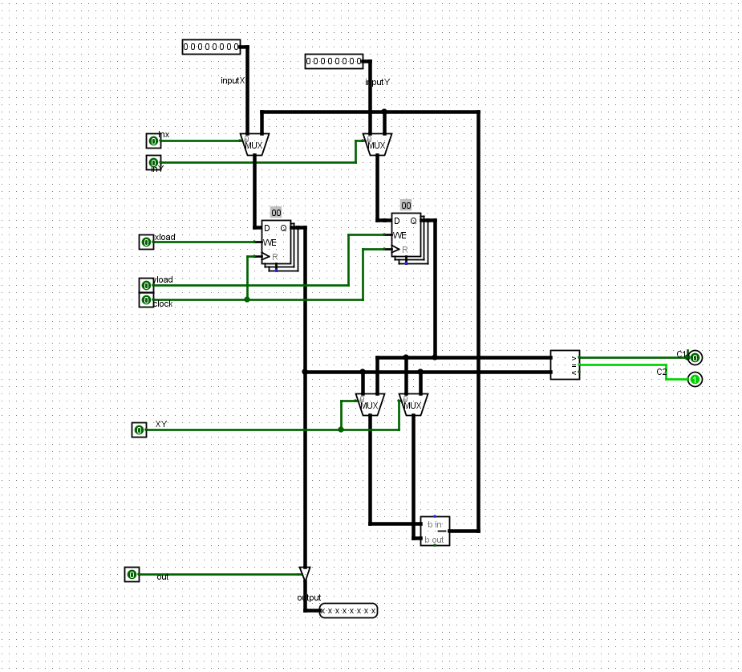
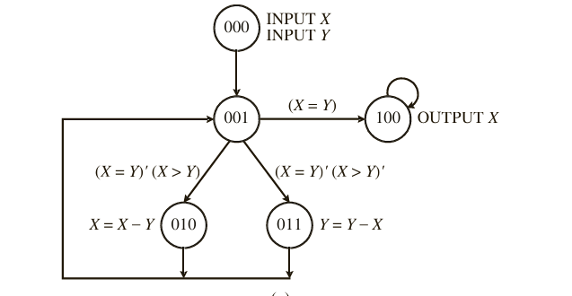
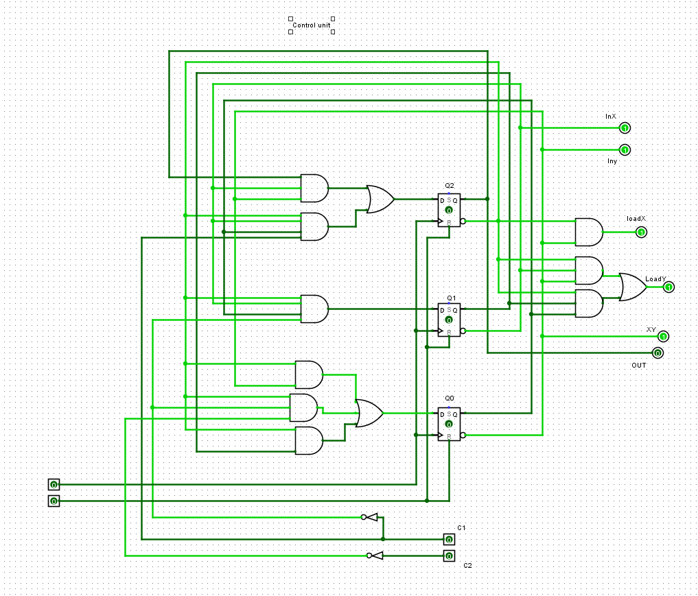

#  Dedicated Microprocessor for GCD Calculation

This repository presents a **dedicated microprocessor** design for computing the Greatest Common Divisor (GCD) of two 8-bit positive integers, implemented in Logisim. The design follows the **FSM+D** (Finite State Machine + Datapath) methodology described in Hwang's *Digital Logic & Microprocessor Design* 

---

## 1. Theory & Algorithm

We employ the **Euclidean Algorithm** to compute GCD(X, Y):

```text
1  INPUT X, Y
2  WHILE (X ≠ Y) {
3    IF (X > Y) THEN
4      X = X - Y
5    ELSE
6      Y = Y - X
7  }
8  OUTPUT X   // or Y, since X == Y
```

Key points:

- Two 8-bit registers store X and Y.
- A subtractor executes `X - Y` or `Y - X` based on comparison.
- A comparator generates two status flags: `EQ` (X == Y) and `GT` (X > Y).

---

##  2. Datapath Design



| Component      | Description                                                               |
| -------------- | ------------------------------------------------------------------------- |
| Registers X, Y | Two 8-bit registers with load control (`XLoad`, `YLoad`)                  |
| Subtractor     | 8-bit subtractor for X-Y and Y-X                                          |
| Multiplexers   | Select inputs for registers and subtractor (signals `In_X`, `In_Y`, `XY`) |
| Comparator     | Produces `EQ` and `GT` flags from X and Y                                 |
| Output Buffer  | Tri-state buffer to drive result on `Out` when `Done` asserted            |

Control signals:

- `In_X`, `In_Y`: choose between primary inputs or subtractor output
- `XLoad`, `YLoad`: load registers X and Y
- `XY`: select subtraction direction
- `Out`: enable output buffer
- `Done`: indicates when computation is complete

---

## 3. State Machine
 

## 3.2 Next-State & Output Table

                              |          Next State (Q₂⁺ Q₁⁺ Q₀⁺)              |

| Current State (Q₂ Q₁ Q₀) | EQ,GT = 00 | EQ,GT = 01 | EQ,GT = 10 | EQ,GT = 11 |
|--------------------------|------------|------------|------------|------------|
| 000 (S0)                 | 001        | 001        | 001        | 001        |
| 001 (S1)                 | 011        | 011        | 010        | 100        |
| 010 (S2)                 | 001        | 001        | 001        | 001        |
| 011 (S3)                 | 001        | 001        | 001        | 001        |
| 100 (S4)                 | 100        | 100        | 100        | 100        |
| 101 (Unused)             | 000        | 000        | 000        | 000        |
| 110 (Unused)             | 000        | 000        | 000        | 000        |
| 111 (Unused)             | 000        | 000        | 000        | 000        |

---

## 4. Control Logic Equations

## 4.1 Next-State Equations (D-FF Inputs)
    # derived via K‑maps
```text
D2= Q2+ = Q2.~Q1.~Q0 + ~Q1.Q0.~Q2(EQ)       
D1 = Q1+ = Q2.~Q1.Q0(¬EQ) +
D0 = Q0+ = ~Q2.~Q0 + ~Q2(~EQ·~GT) +Q2.Q1      // complete per K‑map
```


*(Full equations derived from K‑maps in Hwang, Fig. 7.32(c))*

### 4.2 Control Logic Table

| Control Word | State (Q₂Q₁Q₀) | Instruction        | In_X | In_Y | XLoad | YLoad | XY | Out |
|--------------|----------------|--------------------|------|------|-------|-------|----|-----|
| 0            | 000            | INPUT X, INPUT Y   | 1    | 1    | 1     | 1     | ×  | 0   |
| 1            | 001            | No operation       | ×    | ×    | ×     | ×     | ×  | 0   |
| 2            | 010            | X = X − Y          | 0    | 1    | 1     | 0     | 0  | 0   |
| 3            | 011            | Y = Y − X          | x    | x    | 0     | 0     | x  | 1   |    

---

## 🔗 5. Complete Control Unit Circuit

- Three D flip-flops for state memory (Q2,Q1,Q0)
- Next-state logic network from above equations
- Output decoders for control signals


---

## 📂 Repository Structure

```
/README.md
/GCD_microprocessor.circ
/images/
  ├── datapath.png
  ├── control_unit.png

```
---


## 📚 References

- E. O. Hwang, *Digital Logic & Microprocessor Design With Interfacing*, 2nd Ed., Cengage Learning, 2018. (Ch. 7)

